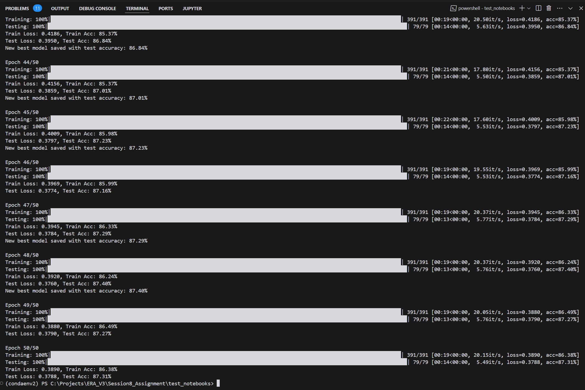

# CIFAR 10 CNN Model Architecture- TSAI ERA V3 Session 8 Assignment

This repository contains a CNN model architecture for the CIFAR 10 dataset.

## Assignment Requirements

The CNN Model requirements are-
1. Less than **200,000 parameters**
2. Testing accuracy of **85%**

## Model Summary:
```
----------------------------------------------------------------
        Layer (type)               Output Shape         Param #
================================================================
            Conv2d-1           [-1, 16, 32, 32]             432
       BatchNorm2d-2           [-1, 16, 32, 32]              32
              ReLU-3           [-1, 16, 32, 32]               0
            Conv2d-4           [-1, 16, 32, 32]             160
            Conv2d-5           [-1, 24, 32, 32]             408
DepthwiseSeparableConv-6           [-1, 24, 32, 32]               0
       BatchNorm2d-7           [-1, 24, 32, 32]              48
              ReLU-8           [-1, 24, 32, 32]               0
            Conv2d-9           [-1, 32, 16, 16]           6,912
      BatchNorm2d-10           [-1, 32, 16, 16]              64
             ReLU-11           [-1, 32, 16, 16]               0
           Conv2d-12           [-1, 32, 16, 16]             320
           Conv2d-13           [-1, 48, 16, 16]           1,584
DepthwiseSeparableConv-14           [-1, 48, 16, 16]               0
      BatchNorm2d-15           [-1, 48, 16, 16]              96
             ReLU-16           [-1, 48, 16, 16]               0
           Conv2d-17             [-1, 64, 8, 8]          27,648
      BatchNorm2d-18             [-1, 64, 8, 8]             128
             ReLU-19             [-1, 64, 8, 8]               0
           Conv2d-20             [-1, 64, 8, 8]          36,928
      DilatedConv-21             [-1, 64, 8, 8]               0
      BatchNorm2d-22             [-1, 64, 8, 8]             128
             ReLU-23             [-1, 64, 8, 8]               0
           Conv2d-24             [-1, 96, 4, 4]          55,296
      BatchNorm2d-25             [-1, 96, 4, 4]             192
             ReLU-26             [-1, 96, 4, 4]               0
           Conv2d-27             [-1, 96, 4, 4]             960
           Conv2d-28            [-1, 128, 4, 4]          12,416
DepthwiseSeparableConv-29            [-1, 128, 4, 4]               0
      BatchNorm2d-30            [-1, 128, 4, 4]             256
             ReLU-31            [-1, 128, 4, 4]               0
           Conv2d-32             [-1, 48, 4, 4]           6,144
      BatchNorm2d-33             [-1, 48, 4, 4]              96
             ReLU-34             [-1, 48, 4, 4]               0
AdaptiveAvgPool2d-35             [-1, 48, 1, 1]               0
           Linear-36                   [-1, 10]             490
================================================================
Total params: 150,738
Trainable params: 150,738
Non-trainable params: 0
----------------------------------------------------------------
Input size (MB): 0.01
Forward/backward pass size (MB): 2.22
Params size (MB): 0.58
Estimated Total Size (MB): 2.81
----------------------------------------------------------------
Total parameters: 150,738
```

## Repository Structure
```
├── README.md
├── train.py ## Main model training and testing script
├── model.py ## Model architecture definition
├── dataset.py ## Dataset loading and preprocessing (including image augmentation)
├── data/
│   ├── train/
│   ├── test/
│   ├── validation/
├── images/
│   ├── Training_logs_1.png
│   ├── Training_logs_2.png 
```

## Model Key Features:
1. **Depthwise Separable Convolution**
2. **Adaptive Average Pooling**
3. **Dilated Convolution**
4. **Batch Normalization**
5. **Image Augmentation**- Used Albumentations Library for Image Augmentation
6. No **Max Pooling** Layers


## Model Final Results
1. Parameters: **150,738**✅
2. Testing Accuracy results:
    - Achieved **85.19%** testing accuracy after **37 epochs**✅
    - Acheived **87.31%** testing accuracy after **50 epochs**✅


## Model Training Logs:



